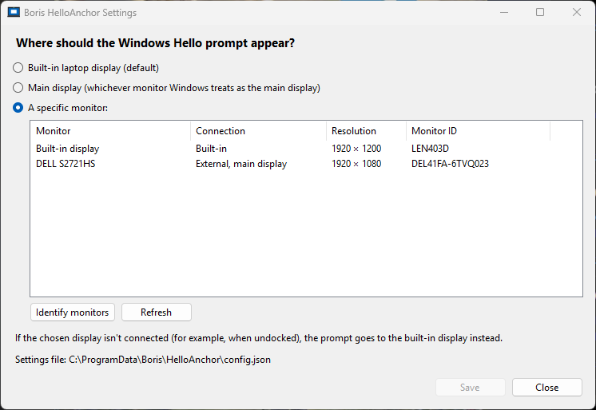

<div align="center">

# Boris HelloAnchor

**Keeps the Windows Hello / "Windows Security" prompt on your laptop's built-in screen, where the face-recognition camera is.**

[](https://github.com/andrewbadge/BorisHelloAnchor/releases/latest)
[](https://github.com/andrewbadge/BorisHelloAnchor/actions/workflows/build.yml)


[](LICENSE)
[](https://buymeacoffee.com/andrewbadge)

[How it works](#how-it-works) ·
[Requirements](#requirements) ·
[Install](#install) ·
[Choosing the display](#choosing-the-display) ·
[Configuration](#configuration) ·
[Logs](#logs) ·
[Security notes](#security-notes) ·
[Standard users](#standard-users-allowsystemtokenfallback) ·
[Limitations](#limitations) ·
[Building from source](#building-from-source) ·
[Contributing](#contributing) ·
[Support](#support-the-project) ·
[Licence](#licence)

</div>

---

When a laptop is docked to an external monitor, Windows often shows the Hello credential prompt (passkeys,
credential prompts, some sign-in confirmations) on the external screen. The IR camera then can't see your
face, so you end up typing a PIN. HelloAnchor watches for that prompt and moves it to the laptop panel
within a fraction of a second, without taking focus.

- Runs in the background: no tray icon, no network access, no telemetry. An optional Settings app lets an
  administrator send the prompt to a different monitor.
- Works with mixed display scaling (per-monitor DPI aware).
- Follows docking, undocking and lid changes automatically.

> HelloAnchor is an independent open-source project. It is not affiliated with or endorsed by Microsoft.
> "Windows Hello" is a trademark of Microsoft Corporation.

### Why Boris?

Boris is a spoodle — the dog of the project's author, [Andrew Badge](https://github.com/andrewbadge).
The project carries his name, just as the author's other Boris projects do.

---

## How it works

Windows blocks a normal (medium-integrity) process from moving the prompt window: `SetWindowPos` fails with
error 5 because of User Interface Privilege Isolation. An **elevated** process can move it. A Windows
service can't do it directly, because services run in session 0 and can't see the user's desktop.

HelloAnchor therefore has two parts:

```
┌──────────────────────── Session 0 ────────────────────────┐
│ Boris.HelloAnchor.Service   (LocalSystem, auto-start)     │
│  • tracks interactive sessions                            │
│  • launches one Agent per session with the user's         │
│    ELEVATED token; restarts it if it crashes              │
└───────────────────────────┬───────────────────────────────┘
                            │ CreateProcessAsUser
┌───────────────────────────▼──────── User session ─────────┐
│ Boris.HelloAnchor.Agent     (elevated, no UI)             │
│  • hooks "window shown" events                            │
│  • spots CredentialUIBroker's "Credential Dialog Xaml     │
│    Host" window                                           │
│  • centres it on the target display and checks it stays   │
└───────────────────────────────────────────────────────────┘
```

The full design is in [`docs/SPEC.md`](docs/SPEC.md).

## Requirements

- Windows 10 or 11, x64.
- A user account that is a **local administrator** (a normal UAC admin is fine: HelloAnchor uses the
  elevated half of your token without showing a UAC prompt). Standard accounts are not supported by
  default; see [Standard users](#standard-users-allowsystemtokenfallback).
- No .NET install is needed: the runtime is bundled.

## Install

1. Download `Boris.HelloAnchor-x.y.z-x64.msi` from the Releases page (or [build it](#building-from-source)).
2. Run it. The service `Boris HelloAnchor` is installed, set to start automatically, and started straight away.

If you sign in with a local administrator account, that's all you need. Standard (non-admin) accounts get no
agent by default; only in that case can an administrator install with `ALLOWSYSTEMTOKENFALLBACK=1`.
**Read [Standard users](#standard-users-allowsystemtokenfallback) first: it weakens a security boundary.**

Check it is working:

```powershell
Get-Service Boris.HelloAnchor
Get-Process Boris.HelloAnchor.Agent   # one per signed-in user
```

To see it in action, set your external monitor as the main display and register a passkey at
<https://webauthn.io> with the camera covered. The prompt should jump to the laptop screen.

### Uninstall

Use **Settings → Apps → Installed apps → Boris HelloAnchor → Uninstall**. The service and program files
are removed. `%ProgramData%\Boris\HelloAnchor` (your configuration and logs) is kept; delete it by hand if
you don't need it.

## Choosing the display

By default the prompt goes to the laptop's built-in screen. To send it to a different monitor (for example,
one with its own Hello camera), open **Boris HelloAnchor Settings** from the Start menu. It asks for
administrator rights, because it changes the machine-wide configuration.



1. Choose **A specific monitor** and pick it from the list. **Identify monitors** shows each monitor's name
   on its own screen for a few seconds, so you can tell which is which.
2. Click **Save**. The agent picks up the change within about a second.

Monitors are recognised by an ID built from their EDID: the model plus the serial number, e.g.
`DEL41B8-5KC0Q83`. The ID follows the physical monitor whichever port or dock it is plugged into, unlike
Windows' `\\.\DISPLAYn` names, which can be renumbered. **If the chosen monitor isn't connected (for example,
when you're undocked), the prompt goes to the built-in display instead.**

The Settings app is optional. It never runs on its own, and HelloAnchor works without it.

## Configuration

Settings live in `%ProgramData%\Boris\HelloAnchor\config.json`. Only administrators can edit this file.
Changes apply within about a second, with no restart needed.

```json
{
  "HelloAnchor": {
    "TargetDisplay": "Internal",
    "TargetDeviceName": null,
    "TargetMonitorId": null,
    "TargetProcessNames": [ "CredentialUIBroker" ],
    "TargetWindowClasses": [ "Credential Dialog Xaml Host" ],
    "VerifyDelaysMs": [ 150, 300, 600, 1000, 2000 ],
    "SkipRemoteSessions": true,
    "AllowSystemTokenFallback": false,
    "AgentRestartBackoffSeconds": [ 2, 5, 15, 60 ],
    "LogLevel": "Information"
  }
}
```

| Setting | Default | Meaning |
|---|---|---|
| `TargetDisplay` | `Internal` | `Internal` (the built-in panel), `Primary` (Windows' main display), `Monitor` (the monitor in `TargetMonitorId`) or `DeviceName`. If the chosen display isn't connected, the built-in panel is used instead. |
| `TargetMonitorId` | `null` | Monitor ID such as `DEL41B8-5KC0Q83`, used when `TargetDisplay` is `Monitor`. The Settings app fills it in. A model-only ID such as `DEL41B8` matches any monitor of that model. |
| `TargetDeviceName` | `null` | GDI name such as `\\.\DISPLAY1`, used when `TargetDisplay` is `DeviceName`. Windows can renumber these on docking, so prefer `Monitor`. |
| `TargetProcessNames` | `CredentialUIBroker` | Processes whose windows are candidates (no `.exe`). |
| `TargetWindowClasses` | `Credential Dialog Xaml Host` | Window classes that must also match. |
| `VerifyDelaysMs` | `150, 300, 600, 1000, 2000` | After each move, re-check at these times (ms) and fix the position if it snapped back or was resized. A safety net: the agent also re-anchors the prompt the moment it becomes visible. |
| `SkipRemoteSessions` | `true` | Don't run in Remote Desktop sessions (they have no internal display). |
| `AllowSystemTokenFallback` | `false` | See [Standard users](#standard-users-allowsystemtokenfallback). |
| `AgentRestartBackoffSeconds` | `2, 5, 15, 60` | Wait before restarting a crashed agent; the last value repeats. |
| `LogLevel` | `Information` | `Trace`, `Debug`, `Information`, `Warning`, `Error`, `Critical` or `None`. |

An invalid value only resets that one setting to its default, and a warning is logged. A broken file
never stops the service.

## Logs

- Files: `%ProgramData%\Boris\HelloAnchor\logs\` contains `service-YYYYMMDD.log` and
  `agent-s<session>-YYYYMMDD.log`. They roll daily and 14 days are kept.
- Windows Event Log: **Application** log, source `Boris.HelloAnchor`, for start/stop, warnings and errors.

Each handled prompt produces one line, for example:

```
Prompt 0x000A1B2C handled: display \\.\DISPLAY1, moves 1, outcome: centred.
```

## Security notes

HelloAnchor runs elevated code, so it is deliberately conservative:

- **Fixed agent path.** The service only ever launches `Boris.HelloAnchor.Agent.exe` from its own
  Program Files folder, never a path from configuration or `PATH`.
- **Protected configuration.** The installer, and the service on every start, reset
  `%ProgramData%\Boris\HelloAnchor` so that only SYSTEM and Administrators can write to it.
  Inheritance from `%ProgramData%` is cut. Files a standard user planted there, including hard links
  and junctions, are removed.
- **Agents die with the service.** Agents run inside a kill-on-close Job Object, so a crashed or killed
  service never leaves agents behind.
- **Minimal attack surface.** The agent has no windows, no IPC endpoint and no network access. Standard
  users can wait on the shutdown signal but cannot trigger it.
- **Settings app is separate.** It runs only when an administrator starts it (it asks for elevation), and
  it talks to nothing but `config.json`. The agent gained no UI or IPC for it.

### Standard users (`AllowSystemTokenFallback`)

A standard (non-admin) user has no elevated token, so by default no agent is started for them and a
warning is logged once. The prompt can't be moved from their unelevated session anyway.

**When you need it:** only when the people using Windows Hello on the machine sign in with **standard
(non-administrator) accounts**, which is common on company-managed laptops.

| Signed-in account | Agent runs as | Fallback needed? |
|---|---|---|
| Local administrator (normal UAC) | The user's own elevated token | **No** |
| Administrator with UAC off, or the built-in Administrator | The user's own token (already elevated) | **No** |
| Standard user | Nothing by default; SYSTEM if the fallback is on | **Yes** |
| Administrator with Windows 11 *Administrator Protection* enabled | May behave like a standard user (see [Limitations](#limitations)) | Possibly |

If every account on the machine is an administrator, leave it off: the fallback is never used for
administrators, even when it is enabled, so turning it on would add risk with no benefit. On a machine
with both kinds of account, only the standard users are affected.

Setting `AllowSystemTokenFallback` to `true` makes the service run the agent **as SYSTEM** on a standard
user's desktop instead. This works, but it puts a SYSTEM process on a desktop that a less-privileged user
controls. **That is a weaker security boundary.** Only turn it on for machines where you accept that
trade-off. As an extra safeguard, the service ignores the setting unless the configuration folder and
file are owned by Administrators/SYSTEM and aren't writable by anyone else.

> **Setting it at install time.** An administrator can choose this setting with the MSI property
> `ALLOWSYSTEMTOKENFALLBACK` (`0` or `1`, default `0`):
>
> ```powershell
> msiexec /i Boris.HelloAnchor-x.y.z-x64.msi ALLOWSYSTEMTOKENFALLBACK=1
> ```
>
> The installer writes it into `config.json` and remembers it for upgrades and repairs, so later upgrades
> keep the value unless you pass the property again. Because the installer re-applies the remembered value
> on every upgrade, change this setting with the property rather than by hand-editing `config.json`.

**Risks of enabling it, especially at install time:**

- **Weaker isolation.** Every standard-user account that signs in gets an agent running as SYSTEM, the most
  privileged account on the machine, on a desktop that the user controls. A bug in the agent, or in how
  Windows isolates it, would then be a path from a standard account to SYSTEM. With the default (`0`)
  there is no such process.
- **It applies to every standard user on the machine.** The setting is machine-wide. You can't enable it
  for one person, and on shared or multi-user machines every standard account that signs in is covered.
- **It spreads with your deployment.** Put into an Intune/SCCM/GPO command line, it is enabled on every
  targeted device at once. Scope the deployment to machines that genuinely have standard-user Hello users.
- **It persists silently.** Later upgrades keep it on without the property appearing on their command line,
  so it's easy to forget it was ever enabled. Record the decision where your team will see it.
- **Hand edits are overwritten.** An upgrade or repair re-applies the remembered installer value to
  `config.json`, so a manual change can quietly revert.
- **The admin-account alternative is safer.** If the user can be a local administrator, HelloAnchor works
  with the default setting and no SYSTEM process is involved.

To turn it off again, upgrade with `ALLOWSYSTEMTOKENFALLBACK=0`. The upgrade stops and restarts the
service, which also stops any running agents, so no SYSTEM agent is running once it finishes. Uninstalling
also stops everything, but leaves `config.json` behind with whatever value it had.

Please report vulnerabilities privately; see [`SECURITY.md`](SECURITY.md).

## Limitations

- UAC consent prompts and the lock/sign-in screen run on the secure desktop, which no application can
  reach. They are out of scope.
- Windows 11 *Administrator Protection* changes how elevation works. HelloAnchor may not be able to get
  an elevated token for your account with it enabled; this is still being verified.
- x64 only for now. ARM64 support is planned (the build is structured for it).
- Standard (non-admin) accounts get no agent unless `AllowSystemTokenFallback` is enabled (see
  [Standard users](#standard-users-allowsystemtokenfallback) and
  [`docs/STANDARD-USERS.md`](docs/STANDARD-USERS.md)).

---

## Building from source

### Prerequisites

- **.NET 10 SDK** (the version is pinned loosely in `global.json`).
- **Visual Studio 2022 17.14+ or Visual Studio 2026** with the ".NET desktop development" workload,
  if you want to use the IDE.
- To open the installer project in Visual Studio, install the free
  [**HeatWave**](https://marketplace.visualstudio.com/items?itemName=FireGiant.FireGiantHeatWaveDev17)
  extension. Command-line builds don't need it.

### Visual Studio

Open **`Boris.HelloAnchor.sln`**. It contains:

| Project | What it is |
|---|---|
| `Boris.HelloAnchor.Core` | Shared library: config, logging, and the pure logic that is unit-tested. |
| `Boris.HelloAnchor.Service` | The LocalSystem Windows service. |
| `Boris.HelloAnchor.Agent` | The per-session elevated agent (WinExe, no UI). |
| `Boris.HelloAnchor.Displays` | Display enumeration (monitor IDs, names, work areas), shared by the Agent and Settings. |
| `Boris.HelloAnchor.Settings` | The optional elevated Settings app (WinForms) for choosing the display. |
| `Boris.HelloAnchor.Installer` | WiX v5 MSI project. It isn't built by a normal solution build because it needs the publish output; use `build.ps1`. |
| `Boris.HelloAnchor.Tests` | xUnit v3 unit tests (Test Explorer). |

### Command line

```powershell
.\build.ps1                                    # build, test, publish, package
.\build.ps1 -SkipTests
.\build.ps1 -CertificateThumbprint <sha1>     # also Authenticode-sign the EXEs and the MSI
.\build.ps1 -PfxPath .\cert.pfx -PfxPassword (Read-Host -AsSecureString)
```

The installer is written to `artifacts\Boris.HelloAnchor-<version>-x64.msi`. Signing is optional and is
skipped if no certificate is given.

Tests on their own:

```powershell
dotnet test --project tests/Boris.HelloAnchor.Tests
```

### Running the agent without the service (development)

From an **elevated** terminal:

```powershell
dotnet run --project src/Boris.HelloAnchor.Agent
```

It runs until you end it in Task Manager, logging to `%ProgramData%\Boris\HelloAnchor\logs`. From a
non-elevated terminal it still runs, but every move fails with error 5, which demonstrates why elevation
is needed. `tools/Move-HelloPrompt.ps1` is the original one-shot experiment.

### Versioning

The single version number is in `Directory.Build.props`. It must be `major.minor.build` (MSI ignores a
fourth part), and it must go **up** for an installed copy to upgrade. Raise it in any PR that changes
what ships:

| Bump | When |
|---|---|
| **Major** | Breaking: a config setting renamed/removed or its meaning changed; install location, service name or data folder changed; Windows versions dropped; anything an admin must act on after upgrading. |
| **Minor** | New backward-compatible capability: a new setting or `TargetDisplay` mode, a new platform (e.g. ARM64), noticeably new default behaviour. |
| **Patch** | Fixes and internal changes: bug fixes, hardening without config changes, dependency bumps, performance, logging. |

Docs-, test- and CI-only changes need no bump.

### CI and releases (GitHub Actions)

| Workflow | Trigger | What it does |
|---|---|---|
| **Build** (`build.yml`) | Push/PR to `main`, manual | Runs `build.ps1` (build, tests, MSI), checks the MSI with `tools/Test-Msi.ps1`, uploads it as an artifact. On PRs, warns if shipped files changed but `<Version>` didn't. |
| **Release** (`release.yml`) | Manual only | Reads the version from `Directory.Build.props`, refuses to go backwards or reuse a tag, builds and verifies the MSI, then creates tag `vX.Y.Z` and a GitHub Release with the MSI and a SHA-256 checksum. |
| **Cleanup old artifacts** (`cleanup-artifacts.yml`) | Daily, manual | Deletes build artifacts older than 7 days, always keeping the newest 3. Never touches release assets. |

To release: merge a PR that raises `<Version>`, then run **Actions → Release → Run workflow**.

## Contributing

Issues and pull requests are welcome. See [`CONTRIBUTING.md`](CONTRIBUTING.md) for how to report bugs,
the coding conventions and the PR checklist. Everyone taking part is expected to follow the
[Code of Conduct](CODE_OF_CONDUCT.md). Report security problems privately as described in
[`SECURITY.md`](SECURITY.md).

By contributing you agree that your contribution is licensed under the project's licence (GPL-3.0-or-later).

## Support the project

HelloAnchor is free software. If it saves you typing your PIN a few times a day, you can say thanks
with a coffee:

<a href="https://buymeacoffee.com/andrewbadge"></a>

## Licence

Copyright © 2026 Boris HelloAnchor contributors.

Boris HelloAnchor is free software: you can redistribute it and/or modify it under the terms of the
**GNU General Public License** as published by the Free Software Foundation, either **version 3** of the
License, or (at your option) any later version. It is distributed in the hope that it will be useful, but
**without any warranty**; without even the implied warranty of merchantability or fitness for a particular
purpose. See [`LICENSE`](LICENSE) for the full text.

If you distribute builds (for example, an MSI), the GPL requires you to make the corresponding source
available to recipients. Linking to the matching tagged release of this repository satisfies that.

The installer bundles third-party components under their own compatible licences: the .NET runtime and
Microsoft.Extensions libraries (MIT) and Serilog (Apache-2.0). See
[`THIRD-PARTY-NOTICES.md`](THIRD-PARTY-NOTICES.md). Both the licence and the notices are installed next to
the program. The WiX Toolset used to build the installer is under MS-RL and is not redistributed.
